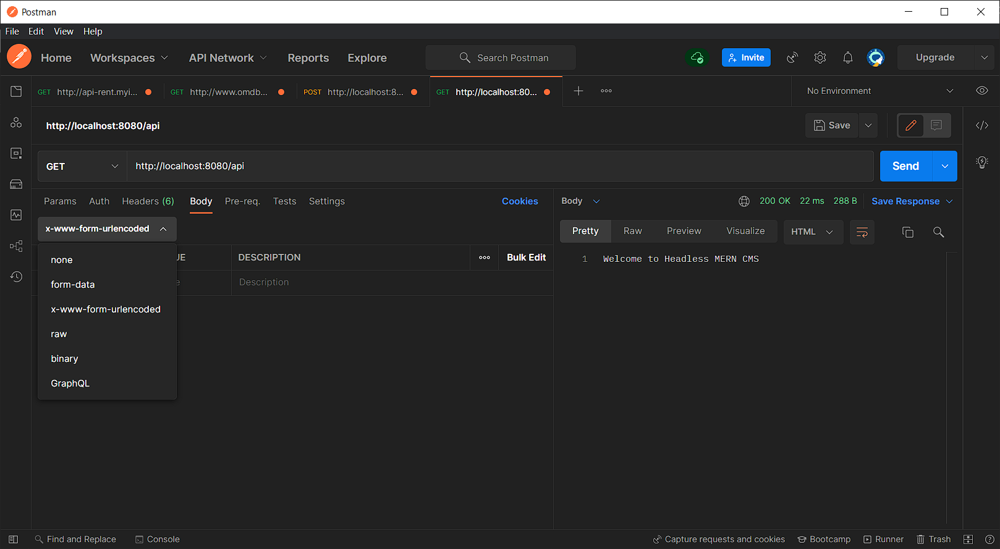

# Setting Up and Introduction.

## Before we start

<h3> This is a part of a Back-end project and information about said project can be found <a href="../blog/">here</a> or in the blog tab of this website. </h3>

--- 

Before jumping in, there are some things that are essential that you have.

## What You Will Need
For This you will need some application, that will make the process alot easier.

Applications required are:

- [Node.js](https://nodejs.org/en/download/) version 14 or above:
  - When installing Node.js, you are recommended to check all checkboxes related to dependencies.
- [Postman](https://www.postman.com/) latest version (v9.11.0):
  - Go thorugh the installation process and make sure you have the latest version installed

### Node.js

You can check if you have Node on your pc by opening up a terminal and running this command:
```bash
node --version
```

You should se something like this: 
```bash
$ node --version
v16.13.2
```
If you don't have Node.js installed head over to their [website](https://nodejs.org/en/) and download appropriate version for your pc.

### Postman

To install postman head over to their [website](https://www.postman.com/) and follow their setup.

--- 


### Using Postman to get and add.

When Postman is installed and running, open up a new tab and test if the server is running by doing a get request to:
(website_handle)/api

If the body displays this: 
```bash
Welcome to Headless MERN CMS
```
Then the connection to the database was successful!


!!! NOTE !!!

In the future, when wanting to review, add or edit data you will have to display the body in Postman and choose in the dropdown menu the **x-www-form-urlencoded** option to be able to access and edit you have posted on the database.



---

## information on Query Params
Here is a list of all the query params. Use them to understand and see if the HTTP requests are succesful.

|HTTP STATUS CODE SUMMARY|            
|----------|
|`200 - OK` &nbsp&nbsp&nbsp&nbsp Everything Worked as expected    |     
|`400 - Bad Request` &nbsp&nbsp&nbsp&nbsp The request was unacceptable, often due to missing a required parameter|  
|`404 - Not Found ` &nbsp&nbsp&nbsp&nbsp The requested resource doesn't exist.|                   

